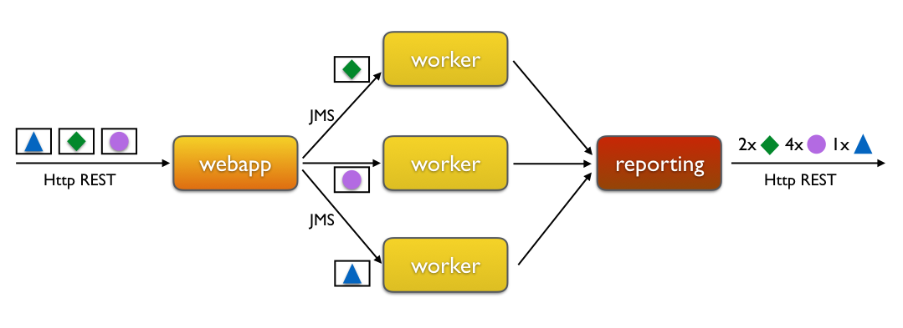

Citrus samples ![Logo][1]
==============

Bakery Demo
---------

The bakery demo sample application offers a multi module Maven project with each module being deployed in a separate
Docker container. The modules are:

* web
* worker
* report

Each of these modules provides Citrus test cases in ***src/test*** Maven test folder. The ***integration*** module contains Citrus
test cases for a complete end-to-end testing of all modules combined.

The bakery sample application uses several services that are exchanging data over various transports. Incoming order requests are routed content based
to one of the worker instances. After the worker has processed the order it will add an entry to the central reporting server. The reporting collects
all events and gives a total order processing overview to clients.



Using embedded Jetty
---------

The sample provides an embedded Jetty option for those of you that are not having Docker installed on the localhost. You can activate
the embedded Jetty infrastructure by calling:

```
mvn clean verify -Dsystem.under.test.mode=embedded
```

This will automatically start embedded Jetty web containers in preparation of the Maven integration-test phase. The sample application is
automatically deployed before the Citrus tests start to perform its actions.

You can also start the embedded infrastructure manually. Execute these commands in separate command line terminals:

```
mvn -pl integration activemq:run -Dsystem.under.test.mode=embedded
mvn -pl integration jetty:run -Dsystem.under.test.mode=embedded
```

Now the bakery sample application is started and you can execute the Citrus tests manually.

Citrus test
---------

Once the sample application is deployed and running you can execute the Citrus test cases in the module folders.
Open a separate command line terminal and navigate to the test folder.

Execute all Citrus tests by calling

     mvn verify

You can also pick a single test by calling

     mvn verify -Dit.test=<testname>

You should see Citrus performing several tests with lots of debugging output in both terminals (sample application server
and Citrus test client). And of course green tests at the very end of the build.

Of course you can also execute the tests from your favorite IDE as Java unit tests with TestNG.

Information
---------

For more information on Citrus see [www.citrusframework.org][2], including
a complete [reference manual][3].

 [1]: https://citrusframework.org/img/brand-logo.png "Citrus"
 [2]: https://citrusframework.org
 [3]: https://citrusframework.org/reference/html/
